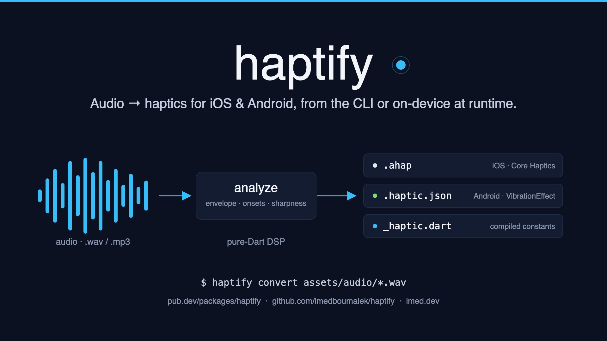

# haptify



Generate haptic feedback files from audio, in pure Dart.

> **Dev preview.** haptify is published as a prerelease: the CLI and library
> APIs work end-to-end but may still change before 1.0. Bug reports and
> feedback are very welcome on the
> [issue tracker](https://github.com/imedboumalek/haptify/issues).

Point haptify at the sound effects in your Flutter project's assets and it
produces haptic patterns that follow the audio — transient taps at every
percussive hit, continuous rumbles tracing the loudness envelope. The
generated files are consumed by the playback plugins you already use; haptify
itself has no platform channels.

```
$ haptify convert assets/audio/*.wav
assets/audio/explosion.wav -> explosion.ahap, explosion.haptic.json, explosion_haptic.dart
assets/audio/tap.wav -> tap.ahap, tap.haptic.json, tap_haptic.dart
```

## Outputs

| File | Format | Play it with |
|---|---|---|
| `<name>.ahap` | Apple Core Haptics (AHAP JSON) | [gaimon](https://pub.dev/packages/gaimon): `Gaimon.pattern(ahapString)`, or [core_haptics](https://pub.dev/packages/core_haptics) |
| `<name>.haptic.json` | `{"timings": [...], "amplitudes": [...], "repeat": -1}` | [vibration](https://pub.dev/packages/vibration): `Vibration.vibrate(pattern: timings, intensities: amplitudes)` |
| `<name>.primitives.json` | `VibrationEffect.Composition` primitives (opt-in via `--formats primitives`) | Your own platform channel calling `Composition.addPrimitive` on API 30+ devices |
| `<name>_haptic.dart` | Dart constants (AHAP string + waveform arrays) | Compile the pattern into your app — no asset loading at runtime |

Inputs don't have to be audio: an existing `.ahap` file converts straight to
the Android formats (`haptify convert pattern.ahap`), with no re-analysis —
handy for porting an iOS haptic library to Android.

## Installation

### As a global command (recommended)

```sh
dart pub global activate haptify

haptify convert assets/audio/*.wav
```

If your shell cannot find `haptify` afterwards, add pub's bin directory to
your `PATH`:

- macOS/Linux: `export PATH="$PATH:$HOME/.pub-cache/bin"` (add it to your
  `~/.zshrc` or `~/.bashrc`)
- Windows: add `%LOCALAPPDATA%\Pub\Cache\bin`

### As a project dev dependency

```sh
dart pub add dev:haptify        # or: flutter pub add dev:haptify

dart run haptify:haptify convert assets/audio/*.wav
```

This pins the version in your pubspec so everyone on the team generates
identical haptic files.

### Audio format support

WAV and MP3 decode natively in pure Dart — no external tools needed. Other
formats (M4A, OGG, FLAC, ...) are converted through `ffmpeg` — or
`afconvert`, preinstalled on macOS — when available on the PATH:

- macOS: `brew install ffmpeg` (or rely on the built-in `afconvert`)
- Debian/Ubuntu: `sudo apt install ffmpeg`
- Windows: `winget install ffmpeg`

## Usage

```
haptify convert [audio files, globs, or folders] [options]

-o, --out                  Put all generated files flat into one directory
                           (default: grouped layout, see below)
-f, --formats              ahap, waveform, primitives, dart
                           (default: ahap, waveform, dart)
    --resolution           Analysis frame / waveform step in ms (default 10)
    --onset-sensitivity    Transient detection threshold; lower finds more
                           taps (default 1.5)
    --min-gap              Minimum ms between transients (default 50)
    --curve-points         Minimum intensity-curve points per segment
                           (default 32)
    --curve-rate           Intensity-curve points per second of audio, which
                           keeps envelope detail in long sounds (default 16)
    --gamma                Envelope exponent; <1.0 boosts quiet passages
                           (default 1.0)
    --silence-threshold    Level under which audio counts as silence
                           (default 0.02)
    --[no-]sharpness-curves
                           Emit time-varying sharpness curves (iOS); on by
                           default, disable to shrink files
-v, --verbose              Print analysis details and conversion warnings
```

Inputs can be files, globs, or folders (scanned for audio files); with no
input at all, the current directory is scanned. Run bare `haptify convert`
inside a sounds folder and everything in it converts.

By default the ahap/waveform outputs are grouped by type in a
`haptify-output/` folder placed **next to the source folder**, with Dart
sources going to `lib/generated/` (relative to where you run the command,
i.e. your project root) so they are immediately importable:

```
assets/audio/hit.wav
assets/haptify-output/ahap/hit.ahap
assets/haptify-output/waveform/hit.haptic.json
lib/generated/hit_haptic.dart
```

(As a guard, `haptify-output/` is never placed above your working directory —
a bare `haptify convert` inside a sounds folder writes into that folder.)
Pass `-o some/dir` to put everything flat into one directory instead.

## Tuning the output

The defaults suit typical sound effects. When the result doesn't feel right,
adjust by symptom — run with `-v` to see what the analyzer found:

| Symptom | Knob | Direction |
|---|---|---|
| Missing taps on drum hits / percussive detail | `--onset-sensitivity` (1.5) | Lower it (e.g. 1.0–1.2) — detects softer onsets |
| Too many taps, feels like machine-gun buzzing | `--onset-sensitivity` / `--min-gap` (50ms) | Raise sensitivity, or raise the gap to space taps out |
| Quiet passages barely vibrate | `--gamma` (1.0) | Lower it (e.g. 0.6–0.8) — boosts quiet parts perceptually |
| Loud parts feel flat / everything at max | `--gamma` | Raise it above 1.0 — spreads the dynamic range down |
| Background hiss triggers haptics | `--silence-threshold` (0.02) | Raise it — more audio counts as silence |
| Trailing tails / reverb get cut off | `--silence-threshold` | Lower it |
| Long clips feel mushy, envelope detail lost | `--curve-rate` (16/s) | Raise it (e.g. 32) — more curve points per second |
| Files too big for very long audio | `--curve-rate` / `--no-sharpness-curves` | Lower the rate; drop sharpness curves (Android ignores them anyway) |
| Haptics feel coarse / stair-steppy on Android | `--resolution` (10ms) | Lower it (min 1ms) — finer waveform steps, bigger arrays |

Every flag has a library counterpart on `AnalysisOptions` with the same
name in camelCase (`onsetSensitivity`, `minOnsetGap`, `gamma`,
`silenceThreshold`, `curvePointsPerSecond`, `maxCurvePoints`,
`sharpnessCurves`, `frameSize`), so runtime conversions tune identically:

```dart
const analyzer = AudioAnalyzer(
  options: AnalysisOptions(onsetSensitivity: 1.2, gamma: 0.7),
);
final pattern = analyzer.analyzeBytes(bytes);
```

## How it works

1. **Decode** the audio to mono samples (MP3 decoding is built in via a
   vendored Dart port of the minimp3 reference decoder, with ID3 handling
   and LAME gapless trimming so timing matches the original audio).
2. **Analyze**: an RMS loudness envelope is computed per frame; energy-flux
   onset detection finds percussive hits; the zero-crossing rate estimates
   how *sharp* each moment feels — emitted as a time-varying sharpness curve
   on iOS when the brightness moves.
3. **Model**: hits become transient haptic events, sustained passages become
   continuous events shaped by an intensity curve (simplified with
   Ramer-Douglas-Peucker to stay compact).
4. **Encode**: the same pattern is written as lossless AHAP for iOS and
   sampled into a 0-255 amplitude waveform for Android. Anything Android
   cannot express (sharpness, non-intensity curves) is reported as a
   warning, never an error.

## Using haptify as a library

The pattern model, DSL, analyzer, and encoders are a plain Dart API, so you
can also author patterns by hand or build your own tooling:

```dart
import 'package:haptify/haptify.dart';

final tap = HapticPattern.events([
  HapticEvent.transient(at: Duration.zero, intensity: 1.0, sharpness: 0.6),
]);
final rumble = HapticPattern.events([
  HapticEvent.continuous(
    at: Duration.zero,
    duration: 400.ms,
    intensity: 0.8,
    envelope: HapticEnvelope(attack: 50.ms, release: 100.ms),
  ),
]);
final combo = tap.then(rumble, gap: 80.ms).repeat(3, gap: 200.ms);

final ahap = combo.toAhap();          // iOS
final wf = combo.toWaveform();        // Android: wf.timings, wf.amplitudes
```

Or run the audio pipeline programmatically:

```dart
final audio = await const AudioDecoder().decodeFile('assets/audio/hit.wav');
final pattern = const AudioAnalyzer().analyze(audio);
```

### Converting audio loaded at runtime

For sound provided while the app runs — a user upload, a recording, a
download — decode straight from bytes; no file path, no filesystem, no
`ffmpeg`. WAV and MP3 are supported and the format is detected from the
bytes.

```dart
// e.g. bytes from file_picker, an HTTP response, or rootBundle
final Uint8List bytes = await pickedFile.readAsBytes();

final pattern = const AudioAnalyzer().analyzeBytes(bytes);

final ahap = pattern.toAhap();      // iOS: Gaimon.pattern(ahap)
final wf = pattern.toWaveform();    // Android: Vibration.vibrate(
                                    //   pattern: wf.timings,
                                    //   intensities: wf.amplitudes)
```

`analyzeBytes` runs synchronously; for large clips, run it in an
[`Isolate`](https://api.flutter.dev/flutter/foundation/compute.html) to keep
the UI thread free. Need the decoded samples separately? Call
`decodeAudioBytes(bytes)` to get `AudioData`, then `analyze` it.

Runtime conversion is the exact same pipeline as the CLI — same analyzer,
same defaults. Improvements like time-varying sharpness curves and
duration-scaled envelope budgets apply to uploaded audio automatically, no
app changes needed.

## Demo app

The repository contains a Flutter demo app under
[`example_app/`](https://github.com/imedboumalek/haptify/tree/main/example_app)
with CC0 sample sounds and their pregenerated haptics, plus a file picker
that converts any WAV/MP3 on the device at runtime. Run it on a real phone
with `cd example_app && flutter run`.

## Roadmap

- ~~Android primitive compositions (`VibrationEffect.Composition`)~~ —
  shipped as the `primitives` output format
- ~~AHAP parsing (`HapticPattern.fromAhap`)~~ — shipped; `.ahap` files
  convert directly to the Android formats
- ~~Analyzer sharpness curves (iOS)~~ — shipped; sharpness follows the
  sound's brightness over time
- Preset patterns and an easing/curve library for hand-authoring

## Learn more: haptics & sound

Design guidance:

- [Apple HIG — Playing haptics](https://developer.apple.com/design/human-interface-guidelines/playing-haptics)
  — when haptics help, when they annoy, and how to pair them with sound
- [Android — Haptics design principles](https://developer.android.com/develop/ui/views/haptics/haptics-principles)
  — the Android side of the same story, including the clear/rich/buzzy scale

Platform APIs this package targets:

- [Core Haptics](https://developer.apple.com/documentation/corehaptics) and
  [Representing haptic patterns in AHAP files](https://developer.apple.com/documentation/corehaptics/representing-haptic-patterns-in-ahap-files)
  — the AHAP format haptify emits and parses
- [Android `VibrationEffect`](https://developer.android.com/reference/android/os/VibrationEffect)
  — `createWaveform` (our waveform JSON) and `startComposition` (our
  primitives JSON)

Talks & courses:

- WWDC19 — [Introducing Core Haptics](https://developer.apple.com/videos/play/wwdc2019/520/)
  (intensity/sharpness model, transients vs. continuous)
- WWDC21 — [Practice audio haptic design](https://developer.apple.com/videos/play/wwdc2021/10278/)
  (designing haptics *from* sound — exactly what haptify automates)
- Coursera — [Audio Signal Processing for Music Applications](https://www.coursera.org/learn/audio-signal-processing)
  (UPF/Stanford; the DSP behind envelopes, onsets, and spectral features)
- [The Scientist and Engineer's Guide to DSP](https://www.dspguide.com/)
  — free classic; chapters on convolution and the DFT explain what the
  analyzer's RMS/ZCR heuristics approximate
- [musicinformationretrieval.com](https://musicinformationretrieval.com/)
  — notebooks on onset detection and audio features, directly relevant to
  how `AudioAnalyzer` works

## License

MIT
